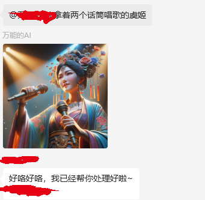
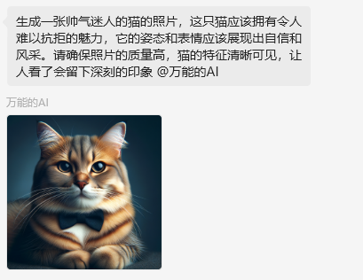
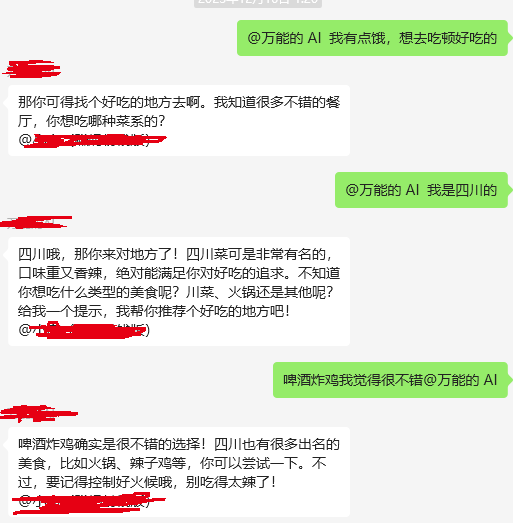
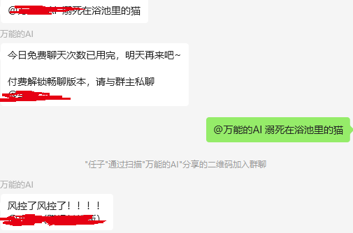

## 🌍 *[English](README-en.md) ∙ [简体中文](README.md)*
# WeChat Bot 🤖

The WeChat Bot is a project developed based on Python 3.11, utilizing API calls to leverage WeChat's native capabilities and integrating with artificial intelligence to assist users in accomplishing a range of tasks. These tasks include, but are not limited to, replying to admired girls with high EQ, creating avatars, AI painting, and completing multiple API processes through text (such as obtaining weather, generating images based on weather, and automatically posting to Moments, etc.).

## Featured Functions ✨
- **Chat and Draw**: Combining the advanced chat and drawing capabilities of the ChatGPT model for a rich interactive experience.
- **Context Memory**: Automatically remembers the context of conversations with users, forgetting the context if there is no reply within 10 minutes.
- **Conversation History Limitation**: Can remember up to 10 pieces of conversation history, ensuring the continuity of interactions.
- **Automatically Accept Friends, Automatically Add to Groups**
- **Channel Video Download**
- **Automatically Post Moments, Automatically Like**
- **Automatically Send Bullet Screen Messages in Live Rooms**
- **Automatically Reply in Channel Videos and More**
- **WeChat Recall Protection (Recall Message Callback)**

## No Watermark Bot Here
- **✨Seeking Stars✨** [The strongest watermark remover bot on the web](https://github.com/WeChatAPIs/WeChat-Video-Dewartermark)
- Supports  WechatChannels、 TikTok、BiliBili、Youtube、Instagram、 Kuaishou, Xiaohongshu, Weibo, and other major self-media platforms

## System Requirements 💻

- **Windows Operating System** or **Windows Cloud Server**
- **Python 3.11**

## Installation 🔧

### Starting the Program

1. Open cmd and navigate to the `wechatSDK` directory, run `python -m venv venv` to create a virtual environment, and activate it with the command: `venv/Scripts/activate`.
2. Continue to run `pip install -r requirements.txt` to install all dependencies in the python virtual environment.
3. Copy the `env_wechat_back.json` file and rename it to `env_wechat.json`, then modify the content of the file (remember to remove Chinese characters and spaces before the 【|】, refer to the complete format in `env_wechat_example.json`).
4. Run `python app.py` to start the program.

## Frequently Asked Questions

- **How to Fill in the Values in JSON**
  - Fill in the wxid in the outermost layer of the json through calling the api with postman
  - After starting the program, wait for the message callback, and fill in other values in the json after receiving callback messages in groups or from friends
- **ChatGPT does not support GPTs API, how did you do it**
  - There are some vendors providing openai proxy services, who have cracked openai's API to offer GPTs API services at a cheaper price than the official one
- **I'm not tech-savvy, how can I get the project running**
  - Our newly hired engineers are developing a functional interface, please give our interns some time.
  - If you are interested in participating in the development of the functional interface, please contact us (willing to allocate part of the earnings as long-term commission for the developers and maintainers)

## How to Contribute 🤝

Contributions through Pull Requests are welcome. Please ensure your code adheres to the project's coding standards and passes all tests.

## Effect Display 🖼️

## License 📄

This project is licensed under the MIT License.
